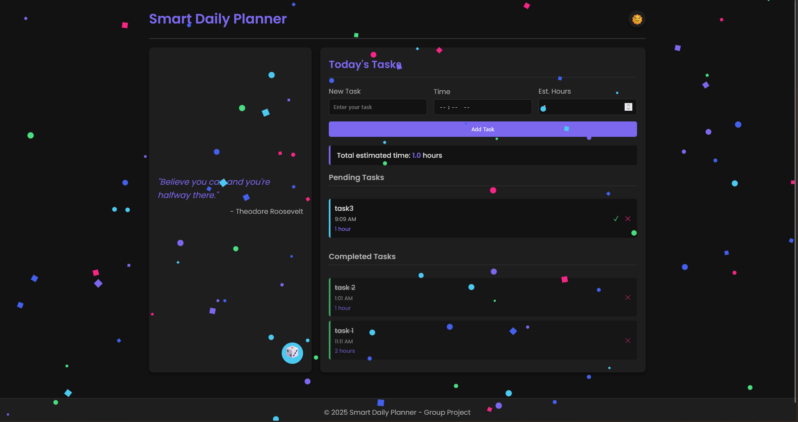

# Smart Daily Planner Dashboard

## Project Information

- **Team Members:**  
    1. Hasan Sezayi IBISOGLU  
    2. Harun Emre ILHAN  
    3. Muhammet Cagri OZATLI  
    4. Berke CANAYAZ  
    5. Batin SENYUZ

## Project Description

Smart Daily Planner Dashboard is a web application designed to help users organize their day efficiently. The application allows users to add, delete, and mark tasks as complete with exact time scheduling. It includes a motivational quote generator and a dark/light mode toggle to enhance the user experience.

## Features Implemented

- **Task Management:** Add, delete and mark tasks as completed
- **Time Scheduling:** Assign specific times to tasks, with automatic sorting by time
- **Motivational Quotes:** Random quote generator to keep users motivated
- **Theme Toggle:** Switch between dark and light modes
- **Visual Feedback:** Confetti celebration when tasks are completed
- **Data Persistence:** Tasks are saved in the browser's local storage

## Individual Contributions

- **Hasan Sezayi IBISOGLU:** Implemented the HTML structure and basic styling
- **Harun Emre ILHAN:** Created the task management functionality (add, delete)
- **Muhammet Cagri OZATLI:** Built the task completion and confetti animation
- **Berke CANAYAZ:** Developed the motivational quote generator feature
- **Batin SENYUZ:** Implemented dark/light mode toggle and responsive design

## Technologies Used

- HTML
- CSS
- JavaScript

## Technical Implementation

The project follows a simple structure with three main files:

1. **index.html:** Contains the structure of the application
2. **styles.css:** Contains all styling and theme variables
3. **script.js:** Contains the application logic and event handlers
4. **confetti.js:** Handles the confetti animation when tasks are completed

## Screenshots

